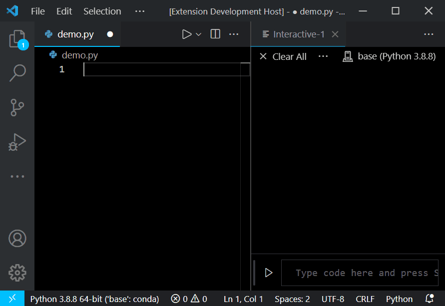

# jimthon: MATLAB array and range syntax macro for Python

This VSCode extension allows one to write simple MATLAB-style range and array syntax inside a `.py` Python file and convert immediately to valid Python syntax. This saves significant frustration for coders with a research background.

**VSCode extension link:** https://marketplace.visualstudio.com/items?itemName=JimZhang.jimthon

## Features

Supported conversions:

1. `for i = a:h:b` becomes `for i in range(a, b, h):`
2. `[a:h:b]` becomes `np.arange(a, b, h)`
3. `[a bc def 3 5]` becomes `np.array([a, bc, def, 3, 5])`

## Usage

Just press the semicolon "`;`" key on the target line. Animation below shows example usage of the plugin, with VSCode Jupyter plugin (not required, but very nice if you hate browser-based Jupyterlab).

-----------------------------------------------------------------------------------------------------------
## Known Issues

- You will need to adjust the `end` argument when using Type-1 and Type-2 conversions (see above). MATLAB `a:h:b` is **inclusive** of `b`, whereas Python's `range(a, b, h)` is **exclusive** of `b`. There is really no general way to deal with this from the plugin's perspective, so this is something the user must deal with.
- Type-1 conversions will convert, but will not run when using float arguments. This is the nature of Python, so you can mix Type-1 and Type-2 conversions (`for x=[1:0.5:10]:` becomes `for x in np.arange(1, 10, 0.5):`) if you really need this.
- Don't try to get too complex, especially with parenthesis and square brackets.
- Don't try this on matrix definitions such as `[1 2 3; 4 5 6]`. It won't work.
- Don't try this when there is already an `np.` command on the same line. It won't do anything.
- Don't use on multiple range/arrays on the same line. It won't work.
- Don't use this when setting `np.array` slices such as `a[:,:,0] = ...`  You are guaranteed to have problems.
- The extension code is really ugly. Don't try to look at it. If you want to rewrite the extension, you can try some special regex cases, and send me a link to your extension :)

-----------------------------------------------------------------------------------------------------------
## Github

https://github.com/EonSin/jimthon

**Enjoy!**
